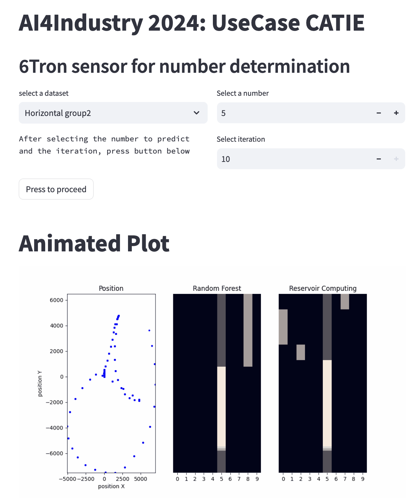

As part of the AI 4 Industry (https://www.ai4industry.fr/), we had the opportunity to participate in the Use Case of
CATIE, technological center specializing in research, development and innovation
in the fields of information and electronics.
-https://www.catie.fr/

The objective of this Use Case was to develop a device to recognize
automatically trace the numbers using a Z motion1 sensor.
-https://6tron.io/use_case/demo-z-motion-ble-imu

Problem: Multiclass classification of time series

In order to have a set of data to analyze, three different groups entered, using
sensors, several series of numbers going from 0 to 9, in 2D on tables/walls and in 3D in
space. The data was collected via the Linux console made available by CATIE by initiating a script python. There are three acquisition modes, we used configurations 1 and 3.

For Configuration 1:
- “t” which represents the timestamp (it is not always regular)
- “raw acceleration x”, “raw acceleration y” and “raw acceleration z” which represent
the linear accelerations of the sensor measured along the x, y and z axes.
- “magnetic field x”, “magnetic field y” and “magnetic field z” which correspond to the
magnetic fields measured along the x, y and z axes.

For Configuration 3:
- “t” which represents the timestamp (it is not always regular)
- “raw acceleration x”, “raw acceleration y” and “raw acceleration z” which represent
the linear accelerations of the sensor measured along the x, y and z axes.
- “quaternion w”, “quaternion x”, “quaternion y” and “quaternion z” which go
represent the components of a quaternion, a mathematical representation of a
orientation in space. In other words, this will describe the 3D orientation of the
sensor.

Methodology: After data acquisition, the plot of the figures is reconstructed from the accelerations on 3 axes. The time series are compressed and their statistical values are used for multiclass classification purposes by comparing the accuracies for logistic regression, a decision tree and a gradient boosting classifier. Then the raw time series are used and each time step is classified with an echo state network model (ESN: a type of reservoir computing that uses a recurrent neural network with a loosely connected hidden layer). Finally, a streamlit application is made available to visualize the decision process of each number acquisition over time.

The different notebooks are organized:
- visualization:
     allows you to display the positions of the sensor in 3 dimensions during the acquisition of a digit (can take into account irregular time intervals by averaging the acceleration over 2 time steps).
- feature_importance:
     ANOVA analysis and comparison to coefficients (features_importance) for the optimized scikit-learn 'LogisticRegression' and 'RandomForestClassifier' models. Comparison of accuracy with parsimonious optimized models. (precision: 0.94, recall: 0.93)
- feature_engineering:
     Optimization of 3 scikit-learn models (LogisticRegression(), DecisionTreeClassifier(), RandomForestClassifier()) by feature engineering. (score: 0.96, time: 0.0044)
- reservoir_computing:
     Training of a simple reservoir (model = [source >> reservoir, source] >> readout) and optimization of the number of neurons, leaking rate and spectral radius. Prediction by time step (score on the entire dataset: 0.8137).
- reservoir_deep:
     Complex reservoir architecture (HierarchicalESN, DeepESLmodel, Multi_input)
- realtime:
     Fine optimization of the RandomForest model for the application

streamlit app:
1- download locally (git clone https://github.com/RCaz33/Time-series_Multiclass-classification_Reservoir-computing-INRIA).
2- create virtual environment (python3 venv .venv; source .venv/bin/activate)
3- install streamlit and run app.py (pip install streamlit; streamlit run app.py)

The application allows you to select one of the recorded data and see step by step the prediction given by the RandomForestClassifier and ESN models trained on all the datasets.

